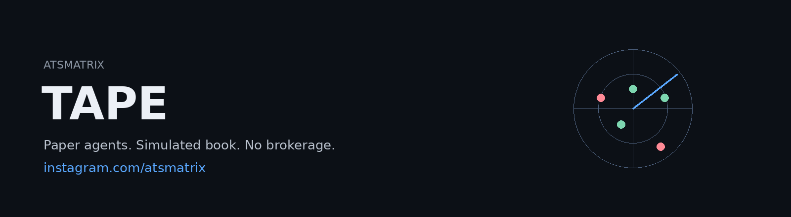
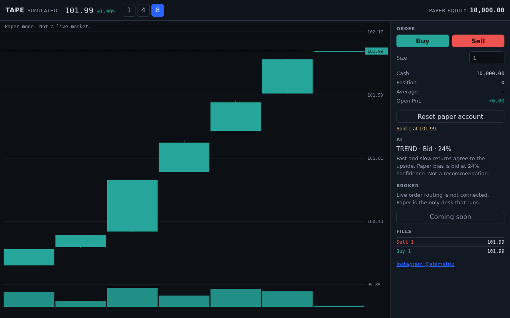
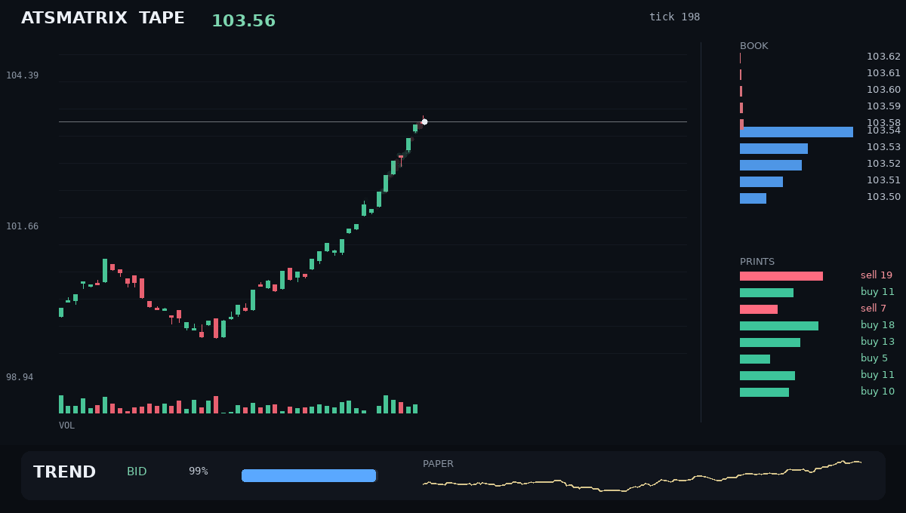
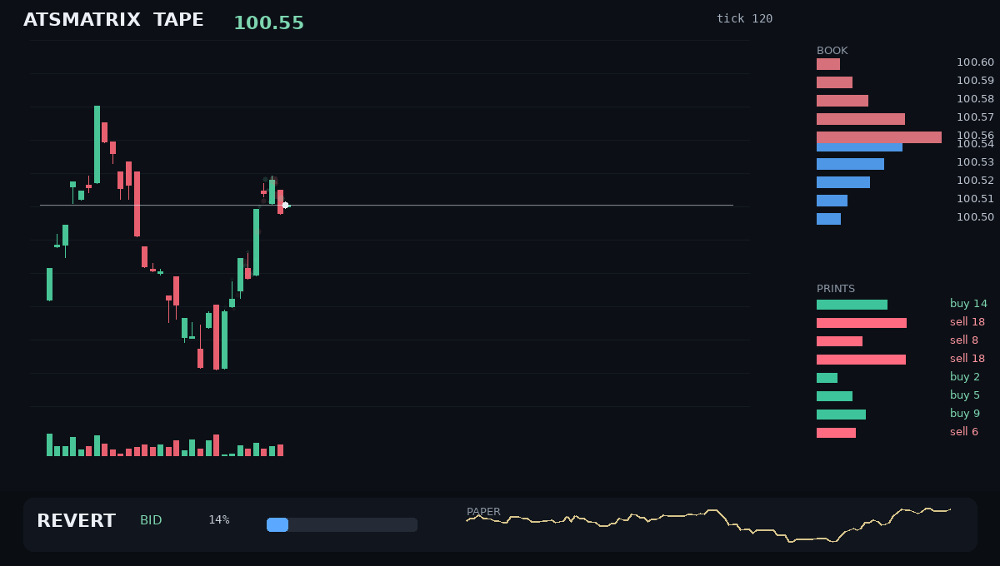
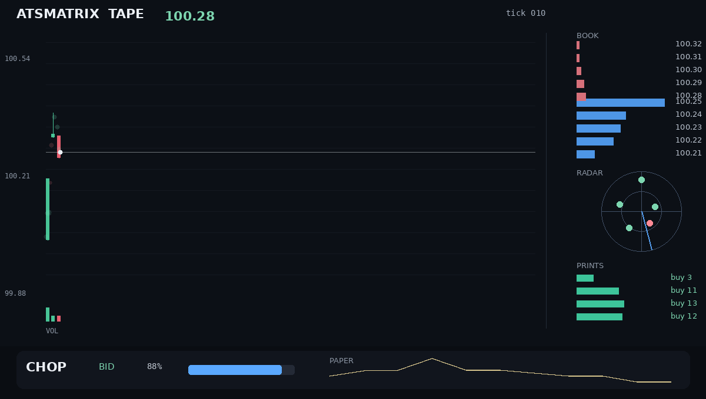
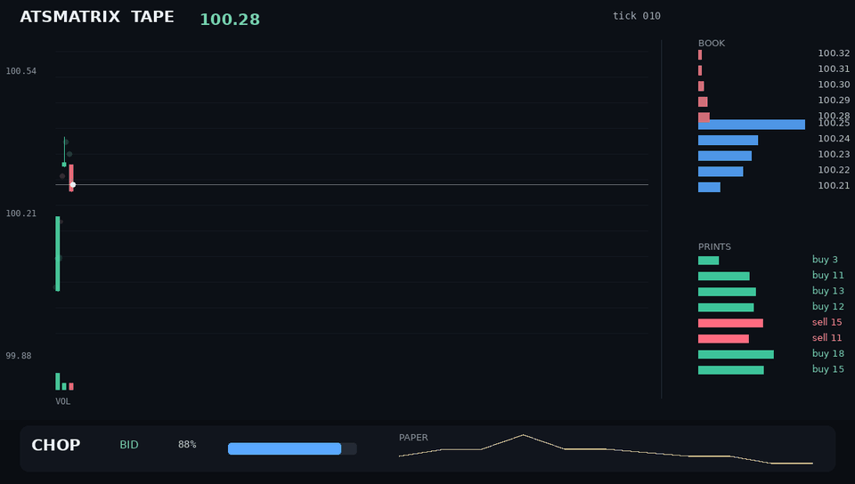

<p align="center">
  
</p>

<p align="center">
  <a href="https://github.com/anyel1to/ATSMATRIX-TAPE"></a>
  <a href="https://github.com/anyel1to/ATSMATRIX-TAPE"></a>
  <a href="https://github.com/anyel1to/ATSMATRIX-TAPE"></a>
  <a href="LICENSE"></a>
  <a href="https://www.instagram.com/atsmatrix/"></a>
  <a href="https://anyel1to.github.io/ATSMATRIX-TAPE/"></a>
</p>

# ATSMATRIX TAPE

A paper trading desk for a simulated tape. The live demo is a working app: candles, crosshair, buy, sell, and an AI note that uses the same score as the Rust signal. The broker button says coming soon. Nothing here sends an order.

| Piece | Job |
| --- | --- |
| Live desk | [anyel1to.github.io/ATSMATRIX-TAPE](https://anyel1to.github.io/ATSMATRIX-TAPE/) — paper orders in the browser |
| C++17 | Synthetic book and the offline frame raster |
| Rust | The signal weights the demo copies |
| Python | Stills, GIF, and the desk video |

It is not a brokerage, not live exchange data, and not financial advice.

## Live desk

Buy and sell change a paper account that stays in the browser. The blue line is your average. The AI panel names the regime and a tip. Reset clears the account. Connect broker stays disabled.



## The tape

Trend. The tape has been lifting. The signal sits **BID** and the paper line is the session so far.



Revert. Momentum and the book disagree. The signal can flip without a story attached.



Chop. Small range, low confidence. A flat bias is a result, not a failure.



## Agents

Five house bots sit on the radar. They paper-trade the same simulated tape. They do not connect to a broker, and they cannot move money.

| Bot | What it follows |
| --- | --- |
| Clerk | Book imbalance |
| Drift | Short momentum |
| Fade | The other side of that momentum |
| Quiet | Only when confidence is already high |
| Print | The last trade |

Green is a paper bid. Red is a paper ask. Distance from the center is how hard the bot is leaning. The sweep is the clock, not a scan of a live market.

On [atsmatrix.com](https://atsmatrix.com) the Tape page lets a visitor add one more paper bot and watch it on the same radar. That bot is stored in the browser. It still does not trade a real account.

## Watch

The session, from the open to the last print. About ten seconds. The file is `docs/tape.mp4` — open it on GitHub and it plays in the browser.

[Play the desk video](docs/tape.mp4)

A shorter loop is below, then the three stills the signal actually produced.



Left side is the C++ raster: candles grouped from the mid, volume under them, fading prints, and a ladder built from the touch size. Right side is the book and the last prints. The bottom rail is the Rust signal, composited by Python: regime, bias, confidence, and paper equity.

## Run

You need `g++` (C++17), `rustc` + `cargo`, `ffmpeg`, and Python 3 with [Pillow](https://pypi.org/project/pillow/).

```bash
make
```

`make` builds the C++ engine, the Rust signal, the stills, the GIF, and `docs/tape.mp4`. GitHub Actions runs the same command on every push to `main`.

- `docs/tape.mp4` — the desk video
- `docs/tape.gif` — a shorter loop for the README
- `docs/*.png` — trend, revert, chop, and the last frame
- `build/tape.csv` — every tick
- `build/signals.csv` — the signal beside each tick

The random walk is seeded. A second `make` draws the same session.

## What the signal actually is

For each tick the Rust desk computes:

- **imbalance** = (bid size − ask size) / (bid size + ask size)
- **mom** = the 8-tick return of the mid
- a slower 24-tick return
- **vol** = mean absolute return over up to 12 ticks

```text
score       = clamp(1.6 * imbalance + 90 * ret8 + 46 * ret24, -3, 3)
confidence  = tanh(|score|)
bias        = sign of the score, or flat when it is near zero
position    = bias only when confidence > 0.42, else flat
pnl         = previous position × the latest mid return
```

Regime is a label, not a hidden model:

- **chop** when volatility and the slow return are both small
- **trend** when the fast and slow returns agree and the move is large enough
- **revert** otherwise

The weights are constants in `signal/src/main.rs`. They were not fit on a historical market. The PnL is paper, on a price this program invented. A pretty equity line is not evidence.

## The session

`engine/tape.cpp` runs 336 ticks from a fixed seed.

- Three regimes take turns: drift up, drift down, and a pull back toward 100.
- The top of book is a spread plus a noisy size imbalance.
- A print hits the touch on most ticks. The ladder you see is five levels scaled off that touch, so it is a picture of the touch, not a reconstructed exchange book.

## Layout

```text
engine/tape.cpp     C++ simulation and raster
signal/src/main.rs  Rust signal desk
viz/desk.py         Python compositor
docs/               README pictures
Makefile            engine, then signal, then frames
```

## License

[MIT](LICENSE). Copyright (c) 2026 ATSMATRIX Technologies / anyel1to.

## Studio

Anyelo Encarnacion — [atsmatrix.com](https://atsmatrix.com) — [github.com/anyel1to](https://github.com/anyel1to)
